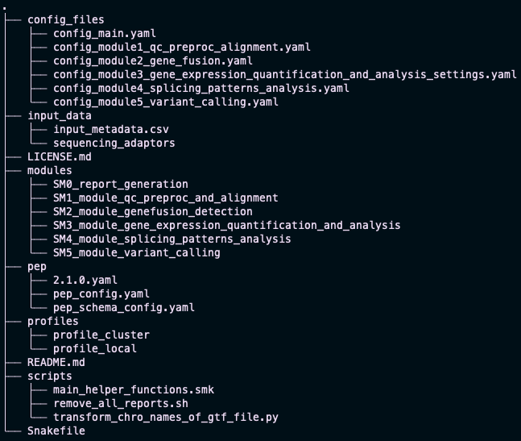

# Installation

SnakeSplice is based on the Snakemake workflow management system. 
The pipeline is written in Python and is compatible with Linux and MacOS.

!!! note "Requirements"
    In order to use SnakeSplice you need to have SnakeMake installed.
    You can either visit the [Snakemake documentation](https://snakemake.readthedocs.io/en/stable/getting_started/installation.html)
    for detailed installation guidelines or use the following instructions to install Snakemake and SnakeSplice.


## Installation via Conda/Mamba
We recommend to install Snakemake and SnakeSplice via the Conda/Mamba package manager.

### 1. Set-up of Conda/Mamba
In order to take advantage of Mamba, an extremely fast and robust replacement for the 
Conda package manager, we recommend to install the managers via the Miniforge installers.
You can find them here: [Miniforge Repository](https://github.com/conda-forge/miniforge#mambaforge)

Here are the steps for Linux systems:
```bash title="Install Conda/Mamba"
curl -L -O "https://github.com/conda-forge/miniforge/releases/latest/download/Miniforge3-$(uname)-$(uname -m).sh"
bash Miniforge3-$(uname)-$(uname -m).sh
```

!!! info "Restart your terminal"
    Don't forget to restart your terminal after the installation!


### 2. Installation of Snakemake
After a successfull installation of Conda/Mamba, you can proceed with installing Snakemake.
```bash title="Install Snakemake"
# Create a new environment
mamba create -n snakemake -c conda-forge -c bioconda snakemake
# Activate the environment
conda activate snakemake
```

!!! tip "Verify the installation"
    You can verify the installation by running `snakemake --version`.


### 3. Get SnakeSplice
After the installation of Snakemake, you can proceed with installing SnakeSplice.
```bash title="Install SnakeSplice"
# Install SnakeSplice by cloning the repository
git clone https://git.bihealth.org/btg/software/snakesplice.git
# Change into the SnakeSplice directory
cd snakesplice
```

The initial set-up should look now like this:



### 4. Adjust your Snakemake Profile
Snakemake gives you the possibility to adjust the pipeline to your specific needs by using [profiles](https://snakemake.readthedocs.io/en/stable/executing/cli.html#profiles).
Here one can define the number of threads, the amount of memory, whether conda environments should be used, and so on...

!!! tip "Default settings"
    The default settings allocate **8 cores** and **30GB of memory** to the pipeline.
    If you want to change these settings, you can do so by adjusting the `config.yaml` file in the `profiles/profile_local` directory.

For this tutorial, we will use the default settings.
You can find the `config.yaml` file [here](example_data/profiles/profile_local/config.yaml).


### 5. Celebrate
You are now ready to use SnakeSplice!  
Please continue with the [tutorial](tutorial_data.md) to learn how to use SnakeSplice.
