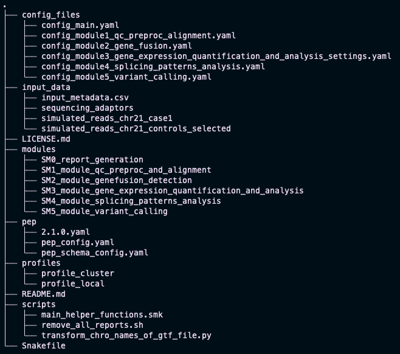

# Tutorial - Data & Introduction
This tutorial will guide you through the SnakeSplice pipeline.
If you haven't installed SnakeSplice yet, please follow the [installation instructions](installation.md) first.
If you are completely new to the workflow system Snakemake, we recommend you to have a look at the [Snakemake documentation](https://snakemake.readthedocs.io/en/stable/).

## Example data
We provide example data for testing SnakeSplice.
It contains simulated RNA-seq data for a control group and three case groups.
All samples are from chromosome 21 of the human genome.
You can download the data from here:

- [Control samples: FASTQ files](https://mega.nz/file/AbFxWKbb#cM7l4jVcGPEoLisZl1bDpnEn47OCb_E01Z2v0_98OME)
- [Case 1 samples: FASTQ files](https://mega.nz/file/9L9WDbJY#vXWAHZh00zg3QTVvHPh4er_Jx_DcBl1y4N2teTxAOmY)
- [Case 2 samples: FASTQ files](https://mega.nz/file/xS8SVBpI#qqOUn2IY18lhSisLgHitSlF9k0UFB8sAn8vWI0EhLN0)
- [Case 3 samples: FASTQ files](https://mega.nz/file/FKdnmKYb#Hk_LpO70_Uwk2O9FekhqkHTV5kblQboFOZzifGmqaLA)

In this tutorial we will use the control samples and the case 1 samples.


### Extracting the data
**Prerequisite**: You need to have downloaded the example data (the Control samples & Case 1 samples) from the links above.
Save the data in a directory of your choice.  

**Now**:
Extract the files from the corresponding archives.
To follow this tutorial please run following commands (here **case1** is used as an example):

``` bash title="Extracting the data"
# Change to your SnakeSplice directory (the 
# cloned SnakeSplice repository)
cd snakesplice

# Create a new directory for the example data
cd input_data

# unpack the downloaded data
tar -xzf /path/to/simulated_reads_chr21_controls.tar.gz -C .
tar -xzf /path/to/simulated_reads_chr21_case1.tar.gz -C .
```

Now you should have two novel directories in your `input_data` directory, one for the control samples and one for the case samples.


## Metadata file
The metadata file is a CSV (Comma Separated Values) file that contains information about the samples.
It is used to link the samples to the corresponding groups and conditions.
You can place the metadata file anywhere on your system, but we recommend to place it in the `input_data` directory.

Attributes:

| Column name | Description | Example |
|---|---|---|
| sample_name | Name of the sample | "sample1" |
| sample_directory | Path to the directory containing the sample | "path/to/sample1" or "some_variable" (some_variable must be defined in PEP config file) |
| read1 | Name of the first read file | "sample1_R1.fastq" |
| read2 | Name of the second read file | "sample1_R2.fastq" |
| control | `true` if sample is control sample or `false` if not | `true` |
| condition | Name of the condition, or None if control sample | `condition1` |
| stranded | Strandedness of the library | "reverse" |
| adaptors_file | Path to the file containing the adaptors | "path/to/adaptors.fa" or "some_variable" (some_variable must be defined in the PEP config file) |

To follow this tutorial you can use the CSV-file as is provided through the SnakeSplice repository (`input_data/input_metadata.csv`). However, the example metadata CSV-file can also be downloaded here: [Download CSV](example_data/input_metadata.csv).

## PEP files
The SnakeSplice pipeline uses the [Portable Encapsulated Project](http://pep.databio.org/) (PEP) format to define the [metadata file](#metadata-file) and to set variables that are used in the metadata file.
The file `pep/pep_config.yaml` is used to identify which file is used as metadata file for our execution and to define variables that are can be referenced in the metadata file.

Changeable attributes (ignore the rest for now):

| YAML directive | Description | Example |
|---|---|---|
| sample_table | Path to the metadata file (relative to this YAML file) | "../input_data/input_metadata.csv" |
| sources | Variables that are used in the metadata file in the columns **sample_directory** and **adaptors_file** | `adaptors_file: "path/to/adaptors.fa"` |


To follow this tutorial you can use the `pep_config.yaml` file as is provided through the SnakeSplice repository. However, the example PEP file can also be downloaded here: [Download PEP](example_data/pep_config.yaml).

## Configuration files
Here we will shortly discuss the structure of the configuration files that are used to control the SnakeSplice pipeline.
However, this is just to give you an overview of the files and their purpose.
We will come back to the configuration files later in the tutorial.

### Main configuration file
The main configuration file for SnakeSplice is called `config_main.yaml` and is located in the SnakeSplice directory under `config_files`.
It defines a name for the project, controls which modules are executed, and sets the paths to the output directories of the respective modules.

Atttributes:

| YAML directive | Description | Example |
|---|---|---|
| run_identifier | Name of the project | "tutorial_run" |
| module_switches | Each module has its own entry here, where the values `True` and `False` signal whether to execute a specific module or not | `True` |
| module_output_dir_names | The paths to the output directories of the respective modules | "output/module1_qc_preproc_and_alignment" |


### Module configuration files
Since SnakeSplice is divided into multiple modules, each module has its own configuration file:

- `config_module1_qc_preproc_alignment.yaml`
- `config_module2_gene_fusion.yaml`
- `config_module3_gene_expression_quantification_and_analysis_settings.yaml`
- `config_module4_splicing_patterns_analysis.yaml`
- `config_files/config_module5_variant_calling.yaml`

Atttributes:

| YAML directive | Description | Example |
|---|---|---|
| switch_variables | Each tool has its own entry here, where the values `True` and `False` signal whether to execute a specific tool | `True` |
| output directories | The name of the output folder for a specific tool | `multiqc_output_dir: "multiqc"` |
| tool-specific parameters | The parameters for a specific tool | `file_kraken2_db: "path/to/kraken2_db"`
| module-specific parameters | The parameters for a specific module | `reference_transcriptome_build: "GRCh38_chr21" ` |


## Summary
After having followed the instructions above, your file structure should look like this (compare with `tree -L 2`):



## Celebrate
You have successfully obtained the data necessary for this tutorial. Great!  
So let's move on to the next step:
[Quality control, pre-processing and alignment](tutorial_alignments.md).
